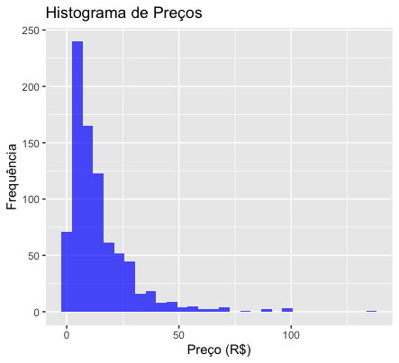
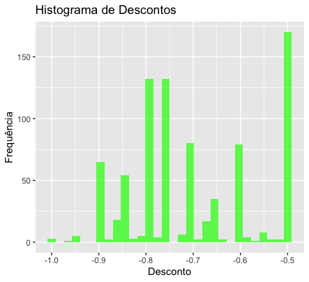
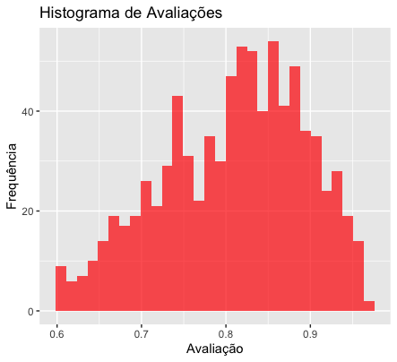

# 1) Raspagem de Dados da Steam


Foi desenvolvindo um script que realiza a raspagem dos dados da [steam](https://steamdb.info/sales/) os resultados são salvos em um arquivo .csv. Alguns pontos relevantes sobre a estrutura do site da Steam merecem destaque: para emular as requisições e coletar os dados, foi necessário usar o Selenium em conjunto com o ChromeDriver, além disso, durante a execução, foi preciso realizar um pequeno scroll ao longo da página para garantir a coleta de algumas colunas que são carregadas dinamicamente.


## Requisitos

- `Python`
- `Selenium`
- `ChromeDriver`

## Configuração

1. **Python**: Instale a partir de [python.org](https://www.python.org).
2. **Selenium**: Execute `pip install selenium`.
3. **ChromeDriver**: Baixe do [ChromeDriver](https://googlechromelabs.github.io/chrome-for-testing/). Garanta que esteja especificado no script.


## Colunas Coletadas

- **Name**: Nome do jogo
- **%**: Desconto atual
- **Price**: Preço atual
- **Rating**: Avaliação
- **Release**: Data de lançamento
- **Ends**: Quando termina a promoção
- **Started**: Quando começou a promoção


# 2) Conectando ao Google BigQuery


### Selecionar todas as linhas

```
SELECT * FROM `beanalytic-423717.beanalytic.beanalytic`
```


### Ordenar pelo nome

```

SELECT `Name` AS `Name`, `Discount` AS `Discount`, `Price` AS `Price`, `Rating` AS `Rating`, `Release` AS `Release`, `Ends` AS `Ends`, `Started` AS `Started`
  FROM (
SELECT * FROM `beanalytic-423717.beanalytic.beanalytic`
)
  ORDER BY `Name` ASC

```

## Links

[Google Shets conectado](https://docs.google.com/spreadsheets/d/1tyL-ACZz9AAzCE_aaDK0agLfGnQwmI0ah0MUoNjB1Co/edit#gid=90847690)


[Extração Ordenado pelo nome](https://docs.google.com/spreadsheets/d/1u96i-NJRRX3ta_pNsX7A6goGPnY8KfaoK7idz-SlJeU/edit?usp=sharing)

# 3) Analytics (Bônus)

Este projeto em R analisa os dados dos jogos disponíveis na plataforma Steam, explorando as distribuições de preços, descontos, e avaliações dos jogos.

## Pré-requisitos

- `R`
- `ggplot2`
- `dplyr`
- `lubridate`

## Análise

 - Preço: Varia de R$0,00 a R$135,74, com uma média de R$14,10. A maioria dos jogos custa menos de R$18,00.

 - Desconto: Varia de -100% a -50%, com uma média de -70%.

 - Avaliação: As avaliações dos jogos estão entre 60,1% e 96,62%, com uma média de aproximadamente 80,92%.


## Plots

### Histograma de Preços
  
Este gráfico mostra a distribuição dos preços dos jogos. A maioria dos jogos tem um preço baixo, com um pico significativo em R$0,00, sugerindo muitos jogos gratuitos ou com descontos que os tornam gratuitos.

### Histograma de Descontos
  
A distribuição dos descontos mostra que muitos jogos têm descontos próximos a -100% (gratuitos), com menos jogos tendo descontos menores. A maioria dos descontos está agrupada entre -50% e -80%.

### Histograma de Avaliações
  
As avaliações dos jogos estão entre 60% e 96%, com uma média aproximadamente de 80%. Há um pico em torno de 80-85%, indicando uma tendência de avaliações positivas na maioria dos jogos.
